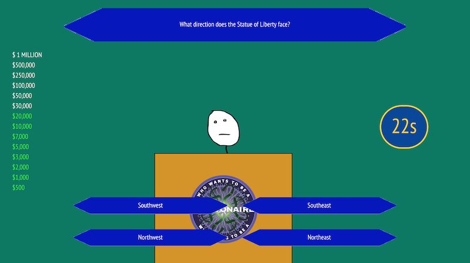

# 'Who Wants to be a Millionaire?' Trivia Game

This application is a trivia game that is modelled around the popular TV game show, 'Who Wants to be a Millionaire?'

## How to play:

1. Select 'Begin'.

2. Answer each of the given questions by clicking one of the four available options.

3. Repeat this until there are no more questions available. If you maintain a streak of answering the questions correctly, similar to the TV show, you will earn more and more in-game money.

4. Select 'Play Again?' if you would like to give it another try.

Created by Arvin Zojaji

Enjoy playing!